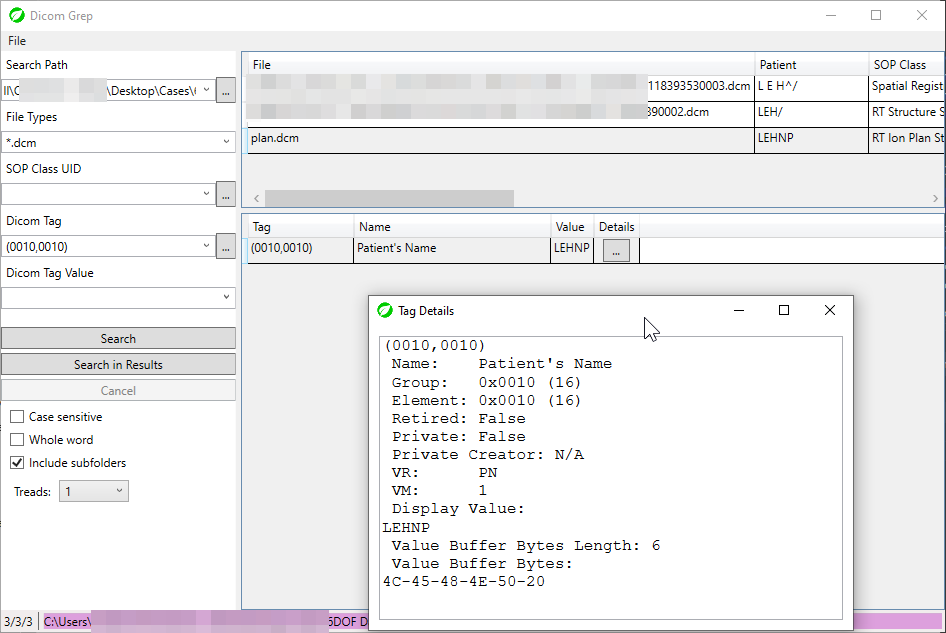
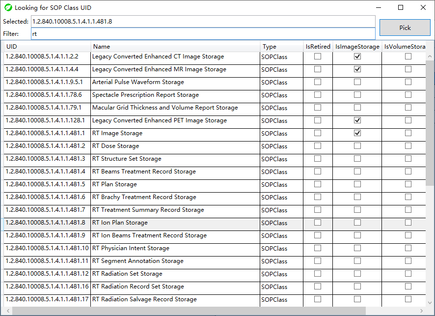
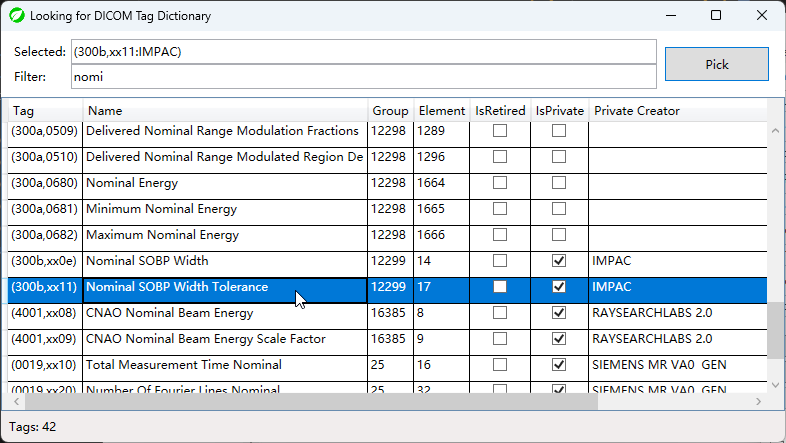

# DicomGrep

An open source tool for searching DICOM files contents.

In "Just can use" state. No warranty.

Hope this tool can help some researchers 👩‍🔬👨‍🔬🔬 or developers 👨‍💻👩‍💻💻 :)

Compiled with .NET 6. You may need install additional runtime for this program.

[](https://github.com/celeron533/DicomGrep/releases)

## Features
1. 🔎 Search DICOM by SOP Class, DICOM Tag and Tag value (of course!).
2. Remember 10 search criteria histories. 📚
3. Multi thread search (no more than logic CPU counts)
4. Simple file operations 📄 (open directory, open file, etc.)
5. Some unexpected bugs 🐛.

### Supported Platforms:

win-x64, win-x86, win-arm64, win-arm32

For Linux and MacOS, you can use WINE, or Virtual machine such as QEMU.

### Use Custom Tag Dictionary
(v1.2.0+) Rename the following files by remove the `.sample` in the middle
```
Private Dictionary.sample.xml --> Private Dictionary.xml
DICOM Dictionary.sample.xml --> DICOM Dictionary.xml
```

And add you own public & private tags in these files. DicomGrep will apply the changes when startup. Then you can see these tags via lookup Window.

## Screenshots
(v1.2.0)








## License
[Microsoft Public License (MS-PL)](License.txt)
