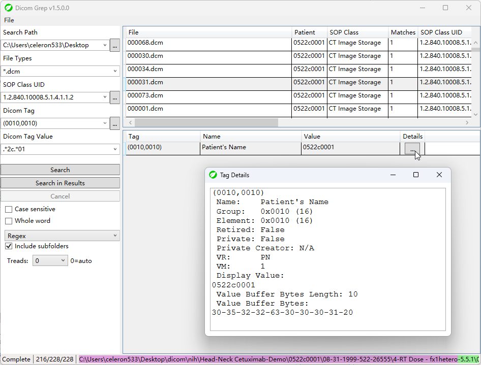

# DicomGrep

An open source tool for searching DICOM files contents.

Inspired by daily work which need to find DICOM files with specific criteria.

Hope this tool can help researchers 👩‍🔬👨‍🔬🔬 or developers 👨‍💻👩‍💻💻 :)

Compiled with .NET 8.0 . You may need install the runtime for this program.

[](https://github.com/celeron533/DicomGrep/releases)

## Features
1. 🔎 Search DICOM by specific SOP Class, DICOM Tag and/or Tag value.
2. When searching the Tag value, you can use also use Wildcard or Regex.
3. Retain 10 search criteria. 📚
4. Multi-thread search (depend on logic CPU counts)
5. Simple file operations 📄 (open directory, open file, etc.)
6. Unexpected bugs 🐛.

### Supported Platforms:

The generic build should support the Windows platform by default:

win-x64, win-x86, win-arm64, win-arm32

For Linux and MacOS, you can use WINE, or Virtual machine such as QEMU.

### Use Custom Tag Dictionary
(v1.2.0+) Rename the following files by remove the `.sample` in the middle
```
Private Dictionary.sample.xml --> Private Dictionary.xml
DICOM Dictionary.sample.xml --> DICOM Dictionary.xml
```

And add you own public & private tags in these files. DicomGrep will apply the changes when startup. Then you can see these tags via lookup Window.

## Screenshots
(v1.5.0)




## License
[Microsoft Public License (MS-PL)](License.txt)
