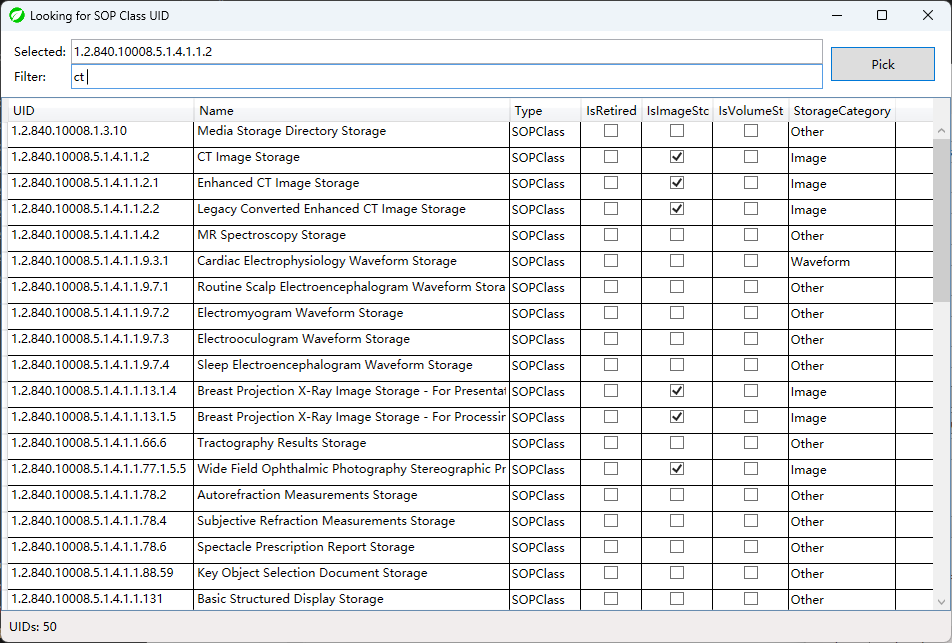

# DicomGrep

An open source tool for searching Dicom files contents.

In "Just could use" state. No warranty.

Hope this tool can help some researchers or developers :)

Compiled with .NET5. You may need additional runtime for this program.

## Features
1. Search DICOM by SOP Class, Dicom Tag and Tag value (of course!).
2. Remember 10 search criteria histories.
3. Multi thread search (no more than logic CPU counts)
4. Simple file operations (open directory, open file, etc.)
5. Some unexpected bugs.

## Screenshot
(v0.9.5-alpha)

## License
[Microsoft Public License (MS-PL)](License.txt)
